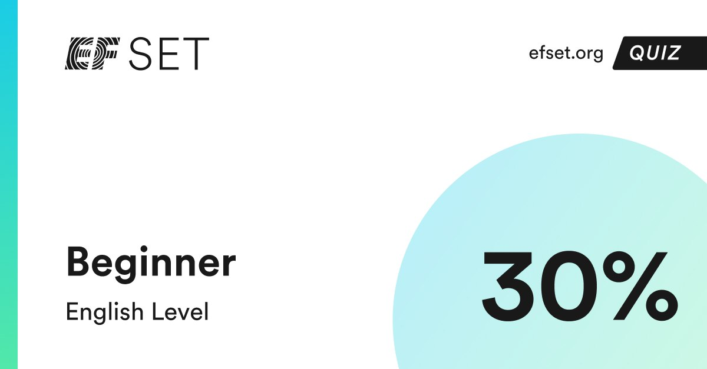

# [rsschool-cv](?)

# Roman Surin

# Studen JS FE Developer
## Contact information:
Phone: +7052335778\
E-mail: ferari0020@mail.ru\
Telegram: @GigaChad_nft
## Briefly About Myself:
I graduated from the Higher Technical College with a degree in software engineering. They taught a little bit of everything, but I was interested in the lessons on learning HTML and CSS, as well as to some extent the js language. My goal is to become a professional JavaScript/Front-end developer and learn English to the fullest.
I think my qualities of perseverance and hard work will help with this.
## Skills and Proficiency:
+ HTML5, CSS3 basics\
+ Git, Github\
+ VS Code\
+ Adobe Photoshop
## Code example:

```
 function multiply(a, b){
 return a * b
} 

const assert = require("chai").assert;
describe("Multiply", () => {
  it("fixed tests", () => {
    assert.strictEqual(multiply(1,1), 1);
    assert.strictEqual(multiply(2,1), 2);
  });
}); 
```

## Education:
+ Secondary vocational program technician\
+ RS Schools Course «JavaScript/Front-end. Stage 0» (in progress)
## Languages:
+ Russian - native 
+ English - Beginner (according to the online test at EFset Logo [www.efset.org](www.efset.org)) \

